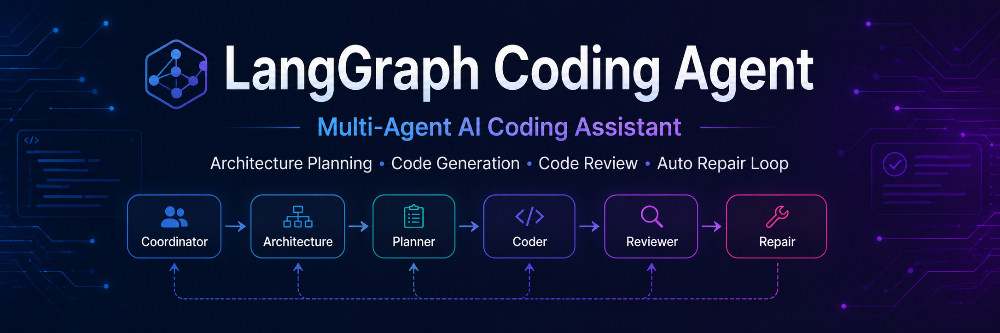
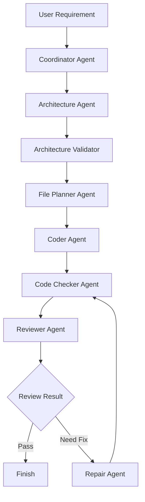
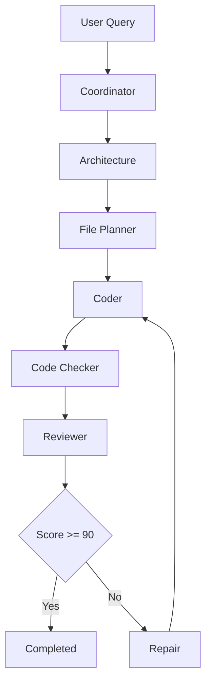

# LangGraph Coding Agent
<p align="center">
  
</p>

<p align="center">
  <b>A Multi-Agent AI Coding Assistant built with LangGraph, LangChain and DeepSeek.</b>
</p>

<p align="center">
  An intelligent coding workflow that enables requirement analysis, architecture design, code generation, review and automatic repair through collaborative AI Agents.
</p>


<p align="center">


</p>


---

# Overview


**LangGraph Coding Agent** is a Multi-Agent AI Coding Assistant framework based on:

- LangGraph
- LangChain
- DeepSeek LLM
- Python


The project explores how Large Language Models can collaborate through Agent Workflow to automate parts of the software engineering process.


The current version implements a complete AI coding pipeline:

```
Requirement Understanding

        ↓

Architecture Design

        ↓

File Planning

        ↓

Multi-file Code Generation

        ↓

Code Checking

        ↓

Code Review

        ↓

Automatic Repair Loop
```


The goal is to build an enterprise-oriented AI software engineering assistant capable of assisting developers during the entire coding lifecycle.


---

# Features


## Multi-Agent Architecture


The system is composed of multiple specialized Agents:


| Agent | Responsibility |
|---|---|
| Coordinator Agent | Analyze requirements and create task workflow |
| Architecture Agent | Design system architecture |
| Architecture Validator | Validate generated architecture |
| File Planner Agent | Plan required source files |
| Coder Agent | Generate multi-file source code |
| Code Checker Agent | Perform code validation |
| Reviewer Agent | Review generated code quality |
| Repair Agent | Fix issues according to review feedback |


Each Agent focuses on a specific responsibility, improving workflow maintainability and scalability.


---

# System Architecture





---

# Workflow


The complete execution workflow:





The workflow supports iterative improvement through:

```
Reviewer

    ↓

Repair Agent

    ↓

Code Checker

    ↓

Reviewer

```


This creates a closed-loop AI coding process.


---

# Project Structure


```
LangGraph-Coding-Agent

│

├── agents

│   ├── architecture.py

│   ├── architecture_validator.py

│   ├── coordinator.py

│   ├── file_planner.py

│   ├── coder.py

│   ├── code_checker.py

│   ├── reviewer.py

│   └── repair.py

│

├── workflow

│   ├── graph.py

│   ├── router.py

│   ├── review_router.py

│   └── task.py

│

├── memory

│   └── state.py

│

├── tools

│

├── prompts

│

├── llm

│

├── rag

│

├── utils

│

├── main.py

│

├── requirements.txt

│

└── README.md

```


---

# Tech Stack


| Technology | Purpose |
|-|-|
| Python | Core Development Language |
| LangGraph | Agent Workflow Orchestration |
| LangChain | LLM Application Framework |
| DeepSeek | Large Language Model |
| Pydantic | State Management |
| FAISS | Vector Retrieval (RAG Extension) |
| Sentence Transformers | Embedding Model Support |


---

# Example


## User Input


```
设计一个 Unity 背包系统并生成代码
```


## Agent Workflow


```
Coordinator

↓

Architecture

↓

File Planner

↓

Coder

↓

Code Checker

↓

Reviewer

```


## Generated Files


Example output:


```
InventoryData.cs

InventoryManager.cs

InventoryController.cs

InventoryView.cs

InventoryEvents.cs

```


The system automatically:

1. Understands the requirement
2. Designs architecture
3. Plans source files
4. Generates code
5. Reviews generated code
6. Repairs detected problems


---

# Installation


## Clone Repository


```bash
git clone https://github.com/MaddieMo1/LangGraph-Coding-Agent.git

cd LangGraph-Coding-Agent
```


---

## Install Dependencies


```bash
pip install -r requirements.txt
```


---

# Configuration


Create environment configuration:


Copy:


```
.env.example
```


Rename:


```
.env
```


Configure:


```env
DEEPSEEK_API_KEY=your_api_key_here

DEEPSEEK_MODEL=deepseek-chat
```


---

# Run


```bash
python main.py
```


---

# Development


## Add New Agent


Create:


```
agents/new_agent.py
```


Implement:


```python
class NewAgent:

    def run(self,state):

        return state
```


Then register the Agent inside:


```
workflow/graph.py
```


---

# Roadmap


## v0.1.0

Completed:


- Multi-Agent Workflow
- LangGraph State Management
- Architecture Planning
- Multi-file Code Generation
- Code Review
- Repair Loop


---

## v0.2.0


Planned:


- Real Compiler Based Code Checking
- Structured Compiler Error Parsing
- Better Code Validation


---

## v0.3.0


Planned:


- RAG Knowledge Retrieval
- Unity API Knowledge Base
- Project Code Understanding


---

## v0.4.0


Planned:


- Long-term Memory
- Human Approval Workflow
- Sandbox Execution Environment


---

# Contribution


Contributions are welcome.

Please read:

```
CONTRIBUTING.md
```


before submitting Pull Requests.


---

# License


This project is licensed under the MIT License.

