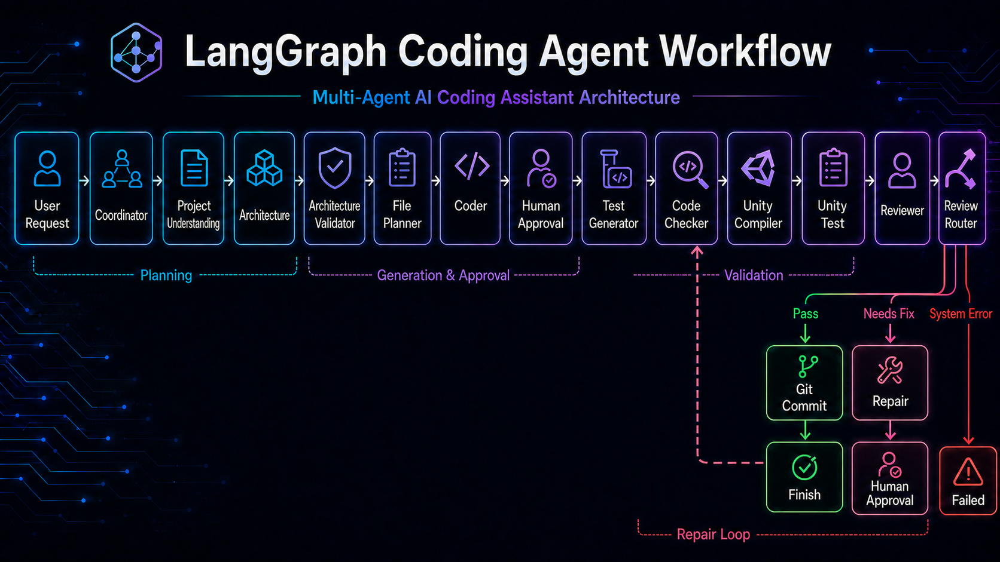
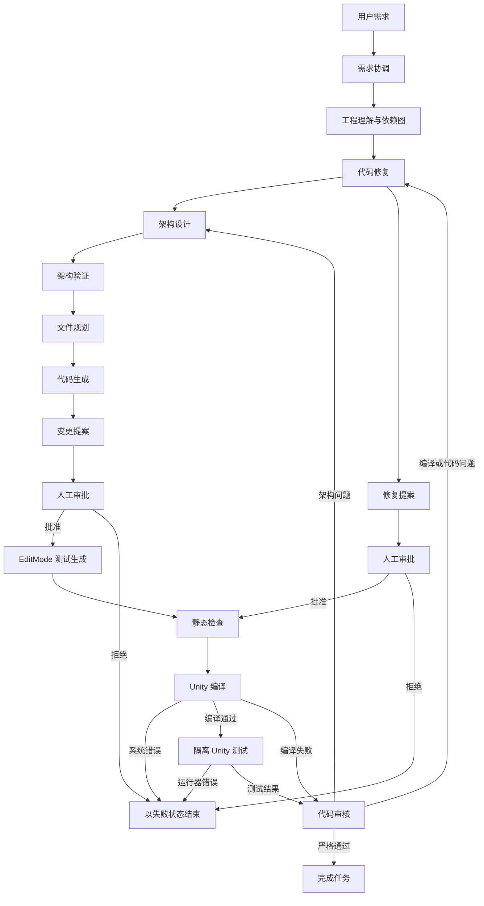
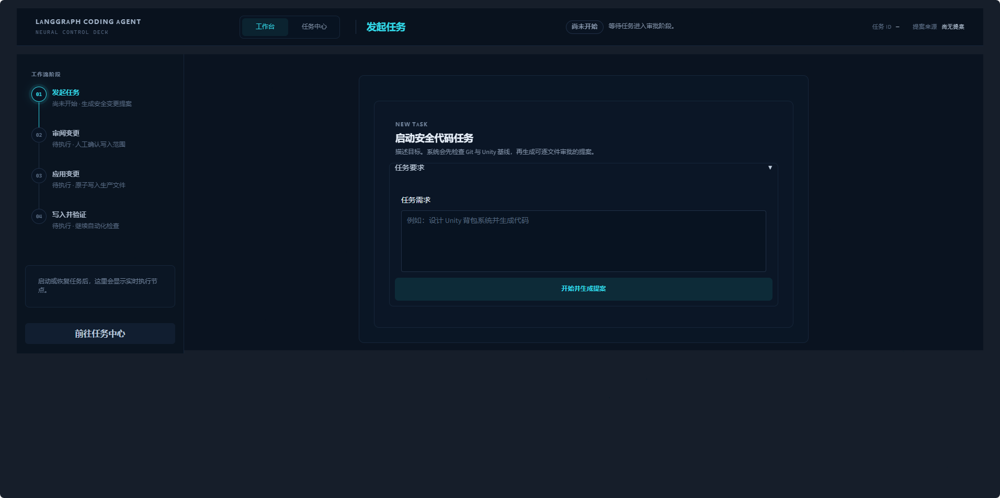
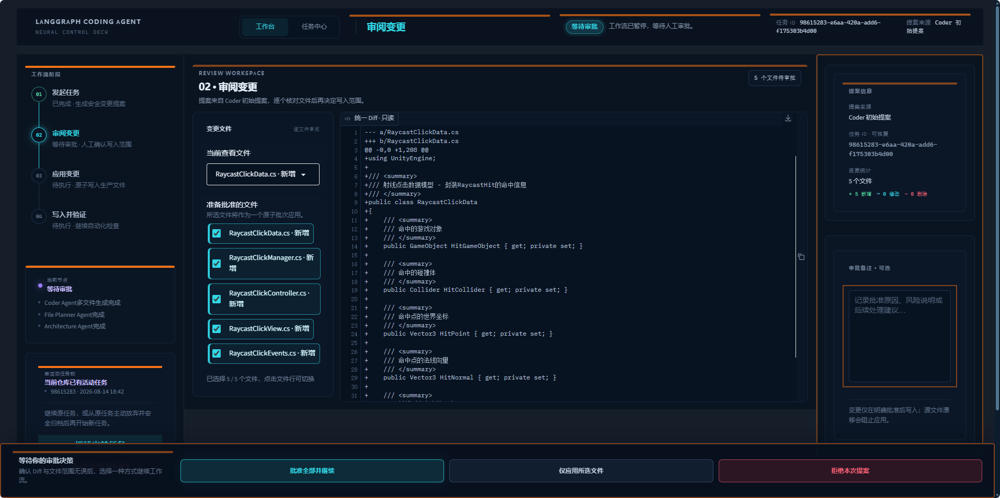
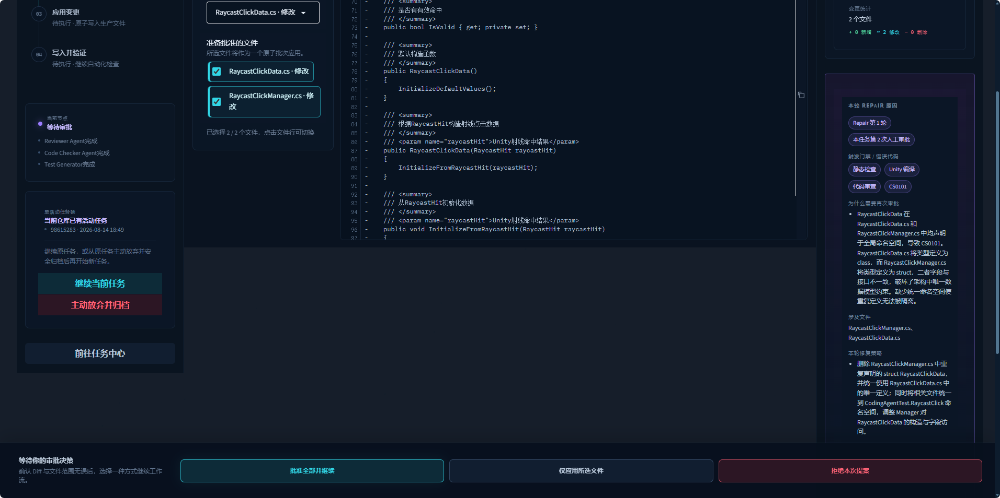
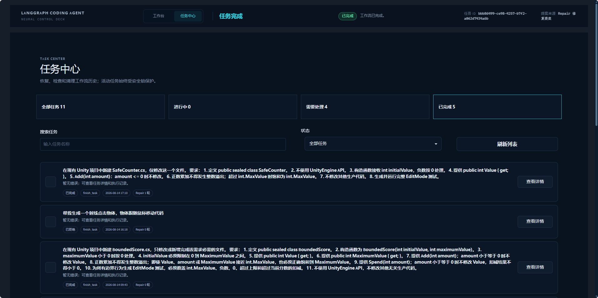
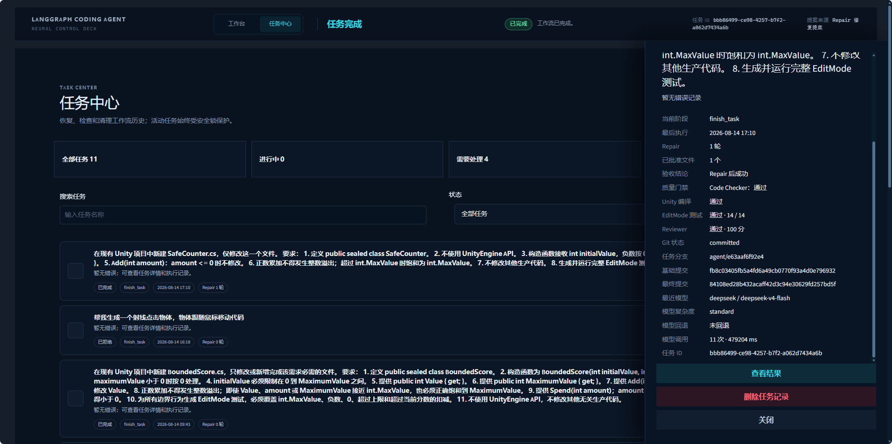
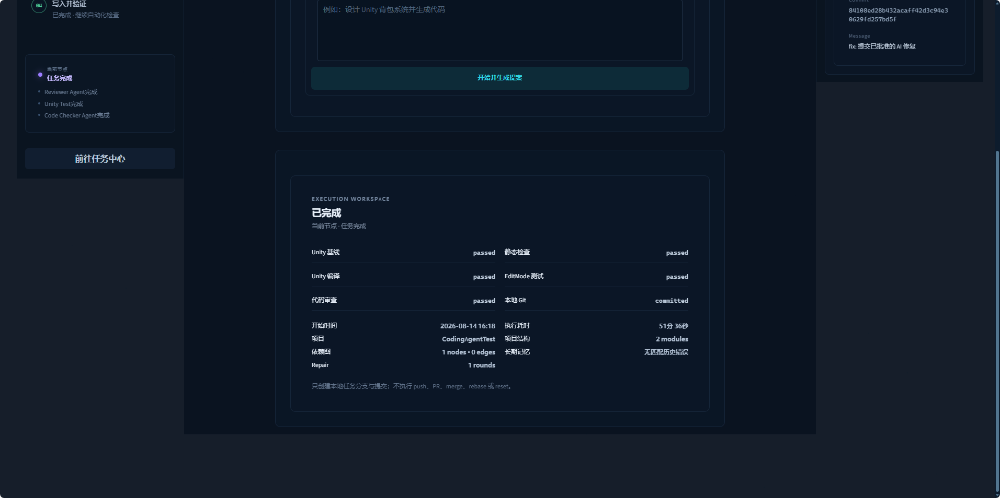
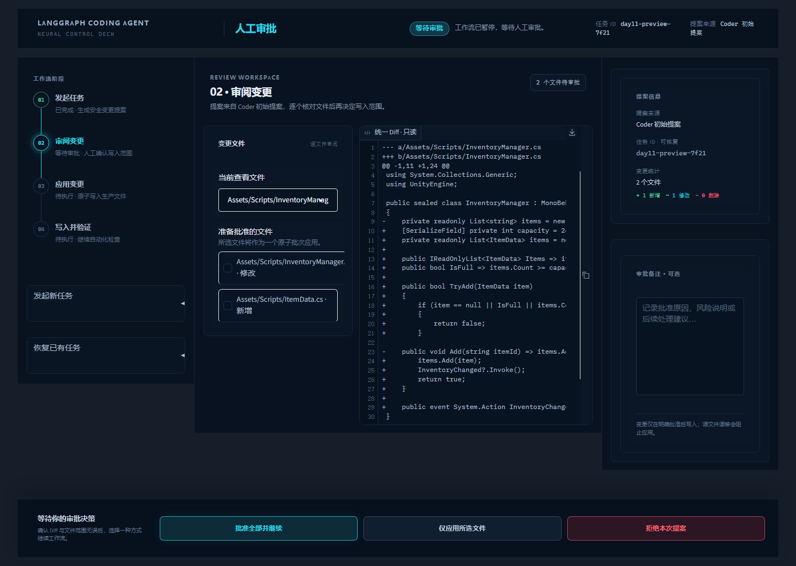

# 🚀 LangGraph Coding Agent

<p align="center">
  
</p>

<p align="center">
  <b>基于 LangGraph、LangChain、确定性多模型路由与 Unity Compiler 构建的多智能体编程工作流。</b>
</p>

<p align="center">
  
  
  
  
  
</p>

## 🌟 项目简介

LangGraph Coding Agent 用于探索多个专业智能体如何协作完成软件工程任务。当前版本可以分析需求、设计架构、规划并生成多个文件、执行静态检查、编译 Unity C# 代码、结合编译器证据进行审核，并在有限次数内自动修复错误。

> 💡 **项目目标**：让 AI Agent 不只“生成代码”，还能够读取真实编译器反馈、定位问题、执行修复并验证最终结果。

```text
需求分析 → 架构设计 → 文件规划 → 代码生成
                              ↓
完成 ← 代码审核 ← Unity 编译 ← 静态检查
           ↓             ↑
         代码修复 ───────┘
```

## 📚 Day01～Day19 学习路线

仓库保留了从基础 Tool Agent 到 v1.0 工程化 Coding Agent 的完整演进过程。建议按顺序阅读各阶段 Notebook；Day04～Day06 同时保留了当时版本的配套源码和 Unity 示例工程，便于对照最终架构理解每一步的变化。

| 阶段 | 主题 | 学习材料 |
|---|---|---|
| Day01 | Tool Agent 与多工具调用 | [Tool Agent](./day01/day01_tool_agent.ipynb) / [Multi-Tool Agent](./day01/day01_multi_tool_agent.ipynb) |
| Day02 | LangGraph 状态、节点、条件路由与 Checkpoint | [基础版](./day02/Day02_LangGraph_Agent.ipynb) / [DeepSeek 版](./day02/Day02_LangGraph_Agent_DeepSeek.ipynb) |
| Day03 | Unity 知识库、Embedding、FAISS 与 RAG | [RAG 基础](./day03/Day03_RAG_Basic.ipynb) / [RAG + LangGraph](./day03/Day03_RAG_LangGraph_Agent.ipynb) |
| Day04 | 读取真实项目并生成代码 | [Day04 Notebook](./day04/Day04_Coding_Agent.ipynb) |
| Day05 | 多 Agent、Reviewer 与基础 Repair Loop | [Day05 Notebook](./day05/Day05.ipynb) / [完整流程记录](./day05/Day05_Multi_Agent_Test.ipynb) |
| Day06 | Unity 编译、结构化错误、Diff Patch 与撤销 | [Day06 Notebook](./day06/Day06.ipynb) |
| Day07 | Unity Project Understanding | [Day07 Notebook](./day07/Day07.ipynb) |
| Day08 | 类型依赖图与影响范围分析 | [Day08 Notebook](./day08/Day08.ipynb) |
| Day09 | EditMode 测试生成与隔离执行 | [Day09 Notebook](./day09/Day09.ipynb) |
| Day10 | 项目级长期记忆 | [Day10 Notebook](./day10/Day10.ipynb) |
| Day11 | `interrupt` 人工审批与 SQLite 恢复 | [Day11 Notebook](./day11/Day11.ipynb) |
| Day12 | 安全本地 Git 分支与提交 | [Day12 Notebook](./day12/Day12.ipynb) |
| Day13 | DeepSeek、Kimi、Qwen、GLM 多模型路由 | [Day13 Notebook](./day13/Day13.ipynb) |
| Day14 | 离线基准与真实 Agent 评估 | [Day14 Notebook](./day14/Day14.ipynb) |
| Day15 | 需求契约、环境预检、CI 与 v1.0 发布 | [Day15 Notebook](./day15/Day15.ipynb) |
| Day16 | Unity API 可信知识检索 | [Day16 Notebook](./day16/Day16.ipynb) |
| Day17 | 审批审计与本地权限控制 | [Day17 Notebook](./day17/Day17.ipynb) |
| Day18 | 团队只读观察、SSE 与断线续传 | [Day18 Notebook](./day18/Day18.ipynb) |
| Day19 | 不可变 Unity 快照、隔离 Worker 与双模式测试 | [Day19 Notebook](./day19/Day19.ipynb) |

> 说明：Day01～Day09 是早期学习快照，保留了当时的实现方式和部分运行输出。模型密钥统一从环境变量读取；涉及真实 Unity 工程的 Notebook 需要根据本机环境设置 `UNITY_EDITOR_PATH` 和 `UNITY_TEST_PROJECT_PATH`。缓存、`.env`、本地向量索引、运行时 JSON 和生成代码未纳入仓库。

## ✨ 已实现能力

- 新增顶部“工作台 / 任务中心”双视图：任务中心提供四类状态统计、搜索与状态筛选、每页 10 条横向任务卡片、右侧详情抽屉以及非活动任务的多选和批量删除。
- 任务中心保留顶部实时运行状态；切换视图不会清空尚未提交的任务输入。列表、筛选、刷新和详情请求使用局部骨架加载反馈，并统一采用深色控件、细边框与悬浮状态。

- 工作流开始前检查生成代码 Git 仓库、提交身份、基线提交和干净状态，并创建 `agent/<id>` 本地任务分支。
- 仅在 Code Checker、Unity Compiler、Unity Test 与 Reviewer 全部通过后进入 Git 提交节点。
- Day11 批准结果会持久化文件路径、操作类型和目标哈希；提交前再次检查文件未发生漂移。
- Git Tool 仅提供状态、Diff、分支、按路径暂存、本地提交，以及用户显式触发的失败现场 stash 归档；不接受任意命令，也不支持 push 或历史改写。
- Neural Control Deck 展示任务分支、基准提交、最终 commit hash、提交信息和结构化 Git 错误。
- Runtime 按当前 Git 分支识别唯一活动任务；刷新页面会自动恢复原任务，重复发起不会创建新的失败 thread。
- 原任务提供“继续当前任务”和“主动放弃并归档”；放弃前校验分支、基准提交、批准文件集合与内容哈希，非所有者任务不能归档该工作区。
- 恢复任务标签末尾显示检查点在 `Asia/Shanghai` 的更新时间（`YYYY-MM-DD HH:mm`）。
- Repair 复审显示修复轮次、人工审批序号、失败门禁、错误代码、根因、相关文件和修复策略；Diff 只保留代码框内部滚动条。

- Coder 与 Repair 只生成补丁提案，生产 C# 文件在人工审批前保持不变。
- LangGraph 使用原生 `interrupt()` 暂停审批，并通过同一 thread ID 恢复工作流。
- SQLite 持久化工作流检查点，进程重启后仍可恢复待审批任务。
- 默认整批批准或拒绝；高级模式支持逐文件选择，批准子集仍原子应用。
- 应用前校验路径、扩展名、源文件哈希和补丁内容；冲突时不写入。
- SQLite 自动列出最近任务，可直接选择并恢复，无需手动记录 thread ID。
- LangGraph 节点状态在任务启动和审批恢复后都实时流式更新，可查看应用、静态检查、Unity 编译、测试、评审与 Git 进度。
- Test Generator 的截断或非法 JSON 会在同一节点自动重试最多 2 次；仍失败时可从失败页沿用原 thread、已批准代码和任务分支执行“重试生成测试”，无需重新生成或审批生产代码。
- Neural Control Deck 顶部标题随工作流状态变化；审批界面默认打开第一个文件，并在固定高度的可滚动 Diff 视口中审阅完整代码。
- Code Checker 在启动 Unity 前检测同一命名空间的跨文件重复类型，并返回冲突类型与文件列表供 Repair 使用。
- 页面使用浏览器原生滚动，并适配桌面、平板和移动端；粒子动效遵循 `prefers-reduced-motion`。

- 工程化 Repair Tool：统一安全边界、结构化修改结果和多文件修复。
- Diff Patch：生成 Git 风格差异、校验源文件哈希、记录补丁历史并支持安全撤销。
- Project Understanding：扫描真实 Unity 工程的 Assets、脚本、模块、Scene、Prefab、类型声明和 GUID 引用。
- Dependency Graph：建立项目内类型依赖图，支持直接依赖、反向依赖和传递依赖查询。
- Architecture 与 File Planner 会读取工程上下文和依赖图，优先复用已有类型并评估修改影响范围。
- 项目上下文和依赖图使用版本化 JSON 协议，可供后续长期记忆和测试阶段复用。
- Test Generator 通过安全 Tool 将结构化 EditMode 测试写入独立目录。
- Unity Test Tool 在临时沙箱工程中运行 NUnit 测试，真实 Unity 工程可以保持打开。
- 测试 XML 报告进入 Reviewer；断言失败进入修复循环，测试基础设施错误安全停止。
- Long-Term Memory 使用版本化 JSON，按 Unity 项目隔离 `project_memory`、`coding_style`、`bug_history` 和 `solution_history`。
- 只有通过后续编译或测试验证的 Repair 才会成为可复用方案；系统与环境错误不会污染缺陷记忆。
- Reviewer 与 Repair 会优先参考同错误码的历史成功方案，但当前 Compiler、NUnit 和 Root Cause 证据始终优先。

## ✅ Day15：Enterprise AI Coding Agent / v1.0

- Coordinator 生成版本化结构化需求契约，统一目标、显式文件范围、工程约束和质量门；空需求安全停止。
- Architecture、File Planner 与 Reviewer 读取同一份检查点契约，不增加 Agent 或模型调用。
- `project_version.py` 统一应用版本，`python -m tools.environment_check` 提供只读环境预检。
- GitHub Actions 在无 Provider、无 Unity、无密钥环境中执行离线回归、Python 编译和空白检查。
- [Day15 Notebook](./day15/Day15.ipynb) 可离线复核需求契约、固定评估指标和发布文件一致性。
- [v1.0.0 发布说明](./docs/releases/v1.0.0.md) 记录兼容性、安全边界、验证证据与已知限制。
- v1.0 UI 已通过真实浏览器视觉复核；恢复中的 Unity 任务在发现 `CS1061` 后正确返回 Repair 人工审批点，没有绕过审批门禁。

## ✅ Day14：Agent Evaluation

- 固定离线基准覆盖首次成功、修复成功、修复耗尽、模型失败和 Unity 环境阻塞，每个案例包含三次确定性运行记录。
- 报告编译成功率、修复成功率、端到端成功率、Token 消耗、循环次数、功能稳定性、路由漂移与失败分类，不生成掩盖质量门失败的综合分数。
- 固定 fixture 的端到端成功率为 2/4、编译成功率为 2/3、Repair 成功率为 1/2、功能稳定性为 5/5；这些分母由基准契约定义，不代表线上流量统计。
- 真实 Provider + Unity 验收记录与离线分数严格分离；零修复链路和 Repair 1 轮后成功链路均通过全部质量门并创建本地提交。
- Repair 真实链路最终通过 Code Checker、Unity 编译、14/14 EditMode 测试和 Reviewer 100 分，提交为 `84108ed28b432acaff42d3c94e30629fd257bd5f`。
- 运行 `python -m evaluation.runner` 可生成 `evaluation/results/day14_evaluation.json` 和仓库根目录的 `evaluation_report.md`。
- `day14/Day14.ipynb` 可在无 LLM、无 Unity、无网络环境下复现核心指标和报告确定性。

## ✅ Day13：Multi-Model Router

- Architecture、File Planner、Coder、Test Generator、Reviewer 和 Repair 不再共享单一模型，按角色与确定性复杂度规则选择模型。
- 快速档使用 `deepseek-v4-flash`；复杂架构、长上下文规划、代码生成、独立 Review 和 Repair 使用各自的专业模型。
- 主模型发生可恢复错误时最多切换一次其他 Provider；输出格式错误先由当前模型纠正一次，再触发回退。
- Provider、模型、复杂度、选择原因、调用次数、耗时和可用 token usage 会持久化，UI 只读展示，不提供逐任务手动选模。
- 不增加 Agent，不改变人工审批、Unity 验证或本地 Git 安全边界。

### Day06-4 编译修复闭环

- 在独立测试工程中执行真实 Unity BatchMode 编译。
- 结构化解析并去重 C# 编译错误。
- 通过 `compile_history`、`review_history` 和 `repair_history` 记录每轮状态。
- 通过 `review_retry_count` 控制 Reviewer JSON 格式异常重试。
- 真实编译器结果优先于模型生成的编译结论。
- 系统或环境错误会终止修复循环，不会被误判为代码错误。
- 只有同时满足以下条件才允许完成任务：
  - Code Checker 检查成功；
  - Unity 编译成功；
  - Reviewer 评分不低于 90；
  - Reviewer 返回 `pass=true`；
  - `remaining_issues` 为空。
- 已验证以下真实修复闭环：

```text
编译失败
→ Reviewer 提取根因
→ Repair Agent 修复
→ Code Checker 复查
→ Unity Compiler 重新编译
→ Reviewer 审核通过
→ finish_task
```

## 🤖 智能体职责

| 智能体 | 职责 |
|---|---|
| Coordinator | 理解用户需求并准备工作流 |
| Unity Knowledge | 缓存优先检索版本匹配的 Unity 官方文档证据 |
| Architecture | 设计目标系统架构 |
| Architecture Validator | 验证架构输出 |
| File Planner | 规划需要生成的源文件 |
| Coder | 生成多文件代码 |
| Code Checker | 执行项目静态检查 |
| Unity Compiler | 同步并编译生成的 C# 文件 |
| Reviewer | 综合代码、静态检查和编译器证据进行审核 |
| Repair | 根据结构化根因修复文件 |

## 🔄 工作流

<p align="center">
  
</p>



修复循环具有明确的次数上限。达到上限时会结束执行，但不会将失败状态误报为成功。

## 📸 运行效果

### 🧭 工作台与安全任务入口

<p align="center">
  
</p>

工作台保留四阶段执行导航、实时任务状态和安全任务入口；切换到任务中心再返回时，尚未提交的任务输入仍会保留。

### 🔍 首次审批与 Repair 复审

<p align="center">
  
</p>

审批阶段默认展示第一个变更文件，完整代码位于固定高度的可滚动 Diff 视口；支持整批批准、仅批准所选文件和拒绝本次提案。Repair 复审会额外展示触发门禁、错误代码、根因、涉及文件和修复策略。

<p align="center">
  
</p>

### 🗃️ 独立任务中心

<p align="center">
  
</p>

任务中心集中展示状态统计、搜索、筛选、分页任务卡和详情入口。活动任务固定置顶并受安全锁保护，非活动任务支持本页全选与批量删除。

<p align="center">
  
</p>

### ✅ 全质量门通过与本地 Git 提交

<p align="center">
  
</p>

只有静态检查、Unity 编译、EditMode 测试和 Reviewer 全部通过，工作流才会在本地任务分支创建提交并显示 commit、分支和基准提交信息；界面同时显示开始时间与执行耗时。

### 🧠 Day11 Neural Control Deck

<p align="center">
  
</p>

界面将任务阶段、实时节点、变更文件、统一 Diff、提案信息和审批操作集中在同一个工作台中。历史任务从 SQLite 检查点自动发现，页面刷新或进程重启后仍可恢复待审批流程。

## 🗂️ 项目结构

```text
LangGraph-Coding-Agent/
├── agents/
│   ├── architecture.py
│   ├── architecture_validator.py
│   ├── code_checker.py
│   ├── coder.py
│   ├── coordinator.py
│   ├── file_planner.py
│   ├── repair.py
│   ├── reviewer.py
│   ├── test_generator.py
│   ├── unity_test.py
│   └── unity_compiler.py
├── memory/
│   ├── dependency_graph.py
│   ├── patch_history.py
│   ├── project_context.py
│   └── state.py
├── prompts/
│   ├── repair_prompt.py
│   ├── reviewer_prompt.py
│   └── test_generator_prompt.py
├── tools/
│   ├── code_check_tool.py
│   ├── dependency_graph.py
│   ├── diff_tool.py
│   ├── file_manager.py
│   ├── project_scanner.py
│   ├── repair_tool.py
│   ├── test_generation_tool.py
│   ├── unity_test_tool.py
│   └── unity_compile_tool.py
├── workflow/
│   ├── graph.py
│   ├── project_understanding.py
│   ├── review_router.py
│   ├── runtime.py
│   ├── router.py
│   └── task.py
├── ui/
│   └── approval_app.py
├── tests/
├── docs/
├── app.py
├── main.py
├── requirements.txt
├── CONTRIBUTING.md
└── LICENSE
```

## 📦 安装

```bash
git clone https://github.com/MaddieMo1/LangGraph-Coding-Agent.git
cd LangGraph-Coding-Agent
pip install -r requirements.txt
```

## ⚙️ 配置

复制 `.env.example` 并重命名为 `.env`，然后配置 DeepSeek 与本地 Unity 测试环境：

```env
DEEPSEEK_API_KEY=your_api_key_here
DEEPSEEK_MODEL=deepseek-chat
DEEPSEEK_BASE_URL=https://api.deepseek.com

UNITY_EDITOR_PATH=D:\Unity\Hub\Unity_Editor\2022.3.62f2c1\Editor\Unity.exe
UNITY_TEST_PROJECT_PATH=D:\Unity\Unity_Project\CodingAgentTest
GENERATED_SOURCE_PATH=D:\path\to\generated-code-repository
GENERATED_TEST_SOURCE_PATH=D:\path\to\runtime-state\generated-tests
WORKFLOW_CHECKPOINT_PATH=D:\path\to\runtime-state\workflow.sqlite
```

Unity 测试工程必须包含有效的 `Assets/`、`Packages/` 和 `ProjectSettings/` 目录。生成脚本只会同步到测试工程的 `Assets/Generated`。

`GENERATED_SOURCE_PATH` 必须指向独立 Git 仓库根目录。首次运行前应执行 `git init -b main`、配置 `user.name`/`user.email`，并创建至少一个基线提交；任务开始时工作区必须干净。验证失败留下已批准文件时，`DIRTY_BASELINE` 页面会列出相关文件，并可由用户显式执行“归档失败现场并清理工作区”；系统使用包含未跟踪文件的 Git stash 保存现场，复核工作区干净后才允许新任务。Day12 不会自动 push 或创建 PR。

测试生成阶段的模型 JSON 解析错误属于可恢复失败：系统先自动重试，重试耗尽后保留 SQLite 检查点、批准证据和任务分支。手动恢复前会重新验证当前分支、基准提交、脏文件集合和批准内容哈希；检测到任何漂移都会拒绝继续。

`GENERATED_TEST_SOURCE_PATH` 和 `WORKFLOW_CHECKPOINT_PATH` 可选，用于将生成测试与 SQLite 检查点隔离到指定运行目录；未配置时继续使用项目内默认路径。`PROJECT_CONTEXT_PATH`、`DEPENDENCY_GRAPH_PATH`、`PATCH_HISTORY_PATH`、`APPROVAL_HISTORY_PATH` 和 `LONG_TERM_MEMORY_PATH` 也支持相同的可选隔离方式。

### Unity API 知识检索（Day16）

知识检索默认离线，并优先读取版本化 JSON 缓存；它不是需要用户维护的本地文档文件夹。**不需要手工下载或放置 Unity 文档**。缓存默认写入 `memory/unity_knowledge_cache.json`，可通过 `UNITY_KNOWLEDGE_CACHE_PATH` 指向独立运行时目录。

如需启用受控联网检索，可显式配置：

```env
UNITY_KNOWLEDGE_NETWORK_ENABLED=true
UNITY_KNOWLEDGE_CACHE_PATH=D:\path\to\runtime-state\unity_knowledge_cache.json
```

联网 Provider 无需额外 API Key，只访问 `docs.unity3d.com` 和 `docs.unity.cn`。它检索需求中明确出现的 Scripting API 名称（如 `Object.Destroy`）、官方文档 URL，以及需求中点名的已安装 Unity Package。自然语言中没有可定位 API 或 Package 时会安全返回无可信证据，不会退回任意网页搜索。

远程页面经过 HTTPS 域名、重定向、内容长度、提示词注入和版本校验；Agent 最多接收 3 条、每条 600 字符的只读摘要。完整远程正文不会展示在审批 UI，也不能扩大结构化需求契约。离线 CI 不设置联网开关，因此不会访问网络。

### Day17 — 审批审计与权限控制

Day17 使用服务启动时绑定的本地身份，不接受浏览器提交的身份或角色。可在 `.env` 中配置：

```env
APPROVAL_ACTOR_ID=local-maintainer
APPROVAL_ACTOR_ROLE=approver
APPROVAL_AUDIT_PATH=D:\path\to\runtime-state\approval_audit.jsonl
```

角色遵循最小权限：`viewer` 只能查看审批与导出审计；`reviewer` 可以记录文件选择和备注；`approver` 可以批准或拒绝；`operator` 可以继续、重试和归档任务，但不能隐式审批。缺少或无效的身份配置会安全降级为 `anonymous · viewer`，审批按钮保持禁用，工作流服务端也会拒绝决策。

`APPROVAL_AUDIT_PATH` 是运行时证据，不是源代码。JSONL 中只保存相对文件名、操作、内容哈希、角色、结果和经过清理的有界备注；不保存完整 Diff、源码、Prompt、模型响应、绝对路径或密钥。每条记录包含单调序号、前序哈希和事件哈希，读取、导出和写入前都会验证完整链。

这套启动身份**不是登录系统**，不提供密码、远程认证或浏览器角色切换，只适用于受信任的本机操作者。控制面仍仅监听 `127.0.0.1` 语义并只允许回环来源访问：团队观察启用全接口监听时，中间件会拒绝非回环来源访问根路径，只放行 `/observe`；局域网观察面不会把审批或运行控制权开放给远程浏览器。

[Day17 Notebook](./day17/Day17.ipynb) 可完全离线复核角色能力、审计事件链接、敏感备注清理和只读验证导出。

### 团队只读观察

团队观察是可选的正式功能，默认关闭。启用时，同一个 FastAPI/Gradio 服务在根路径保留本地控制面，并在 `/observe/ui` 提供局域网只读页面；本机控制台顶部同时显示“团队观察”入口：

```env
OBSERVATION_ENABLED=true
OBSERVATION_READ_TOKEN=replace-with-a-random-token-at-least-32-characters
OBSERVATION_SERVER_NAME=0.0.0.0
OBSERVATION_SERVER_PORT=7860
OBSERVATION_TLS_CERTFILE=D:\path\to\tls\certificate.pem
OBSERVATION_TLS_KEYFILE=D:\path\to\tls\private-key.pem
OBSERVATION_ALLOW_INSECURE_HTTP=false
```

非回环地址必须使用 32～256 字符的共享只读令牌。推荐同时配置 TLS 证书和私钥；只有明确接受局域网 HTTP 可能被窃听令牌与观察数据的风险时，才将 `OBSERVATION_ALLOW_INSECURE_HTTP` 设为 `true`。令牌通过 `POST /observe/session` 换取 `HttpOnly`、`SameSite=Strict` 会话 Cookie，不进入 URL、浏览器持久存储或服务日志。

观察者可填写可选名称，服务端分配不透明观察者 ID。浏览器每 20 秒发送一次在线心跳，60 秒无心跳即显示离线；SSE 使用全局单调游标，并支持标准 `Last-Event-ID` 以及页面重载时的 `after_cursor` 续传。派生事件默认保留 7 天、每个项目最多 5000 条，工作流 SQLite checkpoint 始终是权威状态。

远程响应只包含经过白名单和脱敏的数据：任务阶段、质量门结果、有限错误摘要、模型路由元数据、本地提交哈希和产物文件名。绝对路径、源码、完整 Diff、Prompt、模型响应、环境变量和密钥不会输出。观察路由没有批准、拒绝、继续、重试、取消、Git 或文件修改能力。

[Day18 Notebook](./day18/Day18.ipynb) 可离线复核契约、事件投影、游标续传和多观察者在线状态；[Day18 发布说明](./docs/releases/day18-team-observation.md) 记录完整安全边界与验证证据。

### Unity Worker（Day19）

Day19 将 Unity 执行从控制器进程中分离。控制器构建不可变快照并依次执行 `compile → EditMode → PlayMode`；三个门禁都通过后，才会进入 Reviewer 和路径受限的本地 Git 提交。默认使用本机子进程 Worker，也可显式切换到固定 HTTPS API：

```env
UNITY_WORKER_MODE=local
UNITY_WORKER_STATE_PATH=D:\path\to\runtime-state\unity-worker
UNITY_WORKER_TIMEOUT_SECONDS=900
UNITY_WORKER_NETWORK_MODE=disabled
UNITY_WORKER_NETWORK_ISOLATION_ENFORCED=false

# 仅在已部署独立 Worker 时使用
UNITY_REMOTE_WORKER_URL=https://unity-worker.example.com
UNITY_REMOTE_WORKER_CREDENTIAL=replace-with-a-unique-32-to-256-character-secret
```

远程适配器只接受固定的能力、提交、状态、取消、结果和白名单产物路由，使用时间戳、nonce、请求体摘要与 HMAC 签名；非回环地址强制 HTTPS。它不执行任意远程命令，不接受调用方传入 Unity 命令行或环境变量，也不会在不确定提交后自动回退到本机重投。`network=disabled` 只有在 Worker 明确证明操作系统或容器已强制隔离时才会接受。

本地控制台与 `/observe` 只显示 Worker 模式、脱敏 ID、门禁、状态、耗时、测试计数和稳定错误码；凭据、URL、绝对路径、快照、源码、完整日志、命令、环境变量和 HMAC 材料不会进入观察投影。[Day19 发布说明](./docs/releases/day19-unity-worker.md) 将离线证据、真实本地 Unity 和真实远程 Worker 验收严格分开。

启动前可执行只读环境预检：

```bash
python -m tools.environment_check
```

预检验证 Python 版本、本地审批角色、审计目录、团队观察配置、Provider 路由覆盖、Unity Editor、Unity 测试工程、生成代码独立 Git 仓库和 Git 身份。它不调用网络、不运行 Unity、不修改仓库，也不会输出身份值、令牌、运行时路径或 API Key；非零退出码表示环境尚未满足完整工作流要求。生成代码仓库可以处于脏状态，具体的任务恢复或安全归档仍由现有 Git 工作流处理。

## ▶️ 运行

启动人工审批与可选团队观察服务：

```bash
python app.py
```

未启用远程观察时，服务仅监听 `127.0.0.1`；启用后监听 `OBSERVATION_SERVER_NAME`，但根路径仍是受 Day17 本地身份约束的控制面，团队成员只应访问 `/observe/ui`。服务不会自动创建公共分享链接。默认检查点位于 `memory/workflow_checkpoints.sqlite`；刷新或重启后，可在“恢复已有任务”中直接选择 SQLite 保存的任务。

运行命令行示例：

```bash
python main.py
```

## 🧪 Day06-4 验收标准

已验证的验收流程会先备份 `generated`，再注入一个临时 C# 语法错误，并执行真实修复闭环。通过结果必须同时满足：

```text
第 1 轮：Unity 编译失败，system_error=false
修复阶段：至少有一个成功的文件修改动作
第 2 轮及以后：Unity 编译成功
最终审核：score>=90、pass=true、remaining_issues=[]
最终路由：finish_task
清理阶段：恢复后的 generated 代码再次编译成功
```

> ⚠️ **重要**：不能只根据 `finish_task` 判断成功，必须同时检查编译器、静态检查器和 Reviewer 的状态字段。

## 🗺️ 开发路线

### ✅ v0.1.0 — 已完成

- 多智能体工作流；
- 架构设计与文件规划；
- 多文件代码生成；
- Reviewer 与基础修复循环。

### ✅ v0.2.0 — 已完成（Day06-4）

- 编译器级代码检查；
- 真实 Unity BatchMode 编译；
- 结构化编译错误解析；
- 编译、审核和修复历史；
- 严格通过条件与有限路由；
- 真实编译—修复—验证闭环。

### ✅ v0.3.0 — 已完成（Day06-5 / Day06-6）

- 工程化 Repair Tool；
- 使用精准补丁替代 Agent 直接写文件；
- 补丁历史、版本比较和安全撤销。

### ✅ v0.4.0 — 已完成（Day07 / Day08）

- Unity 工程确定性扫描；
- 版本化 `project_context.json`；
- 项目内类型依赖图；
- 直接、反向和传递依赖查询；
- Architecture 与 File Planner 工程上下文注入。

### ✅ v0.5.0 — 已完成（Day09）

- 安全 EditMode 测试生成；
- 隔离 Unity 沙箱执行；
- NUnit XML 结构化报告；
- 编译、测试、审核联合通过门槛。

### ✅ v0.6.0 — 已完成（Day10）

- 项目隔离的四类长期记忆；
- 缺陷指纹、复发计数和验证后解决状态；
- 历史成功方案的有界检索与提示词注入；
- 原子写入、版本校验和系统错误隔离。

### ✅ v0.7.0 — 已完成（Day11）

- Coder 与 Repair 的 Human in the Loop 审批门；
- SQLite 检查点与 thread ID 恢复；
- 按文件展示 Diff；
- 默认整批审批，高级模式逐文件选择；
- 冲突检测、原子应用、补偿回滚和幂等决策。

### ✅ v0.8.0 — 已完成（Day11 UI / 交互重构）

- Neural Control Deck 科技简约深色界面；
- 历史任务自动发现与选择恢复；
- LangGraph 节点执行进度实时展示；
- 文件选中、禁用、加载和审批状态的完整深色主题；
- 浏览器原生页面滚动与固定审批操作栏；
- 桌面、平板、移动端响应式布局与减少动态效果支持。

### ✅ v0.9.0 — 已完成（Day12）

- 生成代码仓库的干净基线检查与本地任务分支；
- Git 状态、Diff、按批准路径暂存和中文 Conventional Commit；
- 批准文件哈希复核与未批准文件隔离；
- 全验证门禁后的本地提交和持久化 Git 结果；
- 不包含 push、PR、reset、merge、rebase 或历史改写；stash 仅用于用户显式触发、可恢复的失败现场归档。

### ✅ v0.10.0 — 已完成（Day13）

- 按角色和确定性复杂度路由 DeepSeek、Kimi、Qwen 与 GLM；
- 输出格式纠正、受限重试和最多一次跨 Provider 回退；
- 路由、调用次数、耗时和 token usage 持久化与只读展示；
- 保持现有 Agent 数量、人工审批、Unity 门禁和 Git 权限不变。
- 四家 Provider 最小真实调用通过；真实 Unity 2022.3 全链路完成生成、审批、编译、7/7 EditMode 测试、Reviewer 100 分和路径受限的本地 Git 提交。

### ✅ v0.11.0 — 已完成（Day14）

- 固定、可复现且只读的离线 Agent 基准；
- 端到端、编译、Repair、Token、循环、稳定性、路由漂移与失败分类指标；
- 确定性 JSON/Markdown 报告与 no-LLM Notebook；
- 离线分数与真实 Provider + Unity 验收证据严格分离；
- 零修复与 Repair 1 轮后成功两条真实链路均通过全部质量门并创建本地提交。

### ✅ v1.0.0 — 已完成（Day15）

- Coordinator 生成版本化结构化需求契约，并在空需求时安全停止；
- Architecture、File Planner 与 Reviewer 共享同一目标、文件范围、约束和验收门禁；
- `project_version.py` 作为应用版本号的单一来源，UI 标题与 README 统一为 v1.0.0；
- `python -m tools.environment_check` 提供不联网、不泄露密钥的只读环境预检；
- GitHub Actions 执行无需 Provider、Unity 或密钥的完整离线测试、Python 编译与空白检查。
- `day15/Day15.ipynb` 与 `docs/releases/v1.0.0.md` 提供可复现教程、发布证据、兼容性和已知限制。
- v1.0 UI 通过真实浏览器复核；运行时任务恢复后仍严格停在 Repair 人工审批边界。

### ✅ v1.1.0 — 已完成（Day16～Day18）

- 增加仅信任 Unity 官方域名、版本匹配且证据有界的 Unity API 知识检索；
- 增加服务端本地角色权限、哈希链接审批审计链和事务式审批证据；
- 增加同一服务内的团队只读观察、脱敏任务名称、SSE 断线续传、多观察者在线状态及本机控制面隔离；
- 使用真实手机完成第二设备验收：观察页正常连接，局域网控制台根路径保持拒绝访问；
- [v1.1.0 发布说明](./docs/releases/v1.1.0.md) 记录新增能力、安全边界、兼容性、验证证据与已知限制。

### ✅ Day16 — 已完成（Unity API 知识检索）

- 在 Project Understanding 与 Architecture 之间加入确定性的 Unity Knowledge 节点，不增加新的 LLM Agent；
- 按项目本地知识、版本化缓存、受控联网顺序检索，并默认保持离线；
- 联网仅允许 Unity 官方文档域名，校验 HTTPS、重定向、内容边界、版本匹配和提示词注入；
- Architecture、Coder、Reviewer 与 Repair 最多接收 3 条经过复核的只读证据，不能扩大需求契约；
- UI 展示检索状态、Unity 版本、匹配结果、标题和官方链接，不暴露完整远程正文；
- 离线 Notebook、真实 `Object.Destroy` 官方文档探针及 380 项完整 Python 回归测试均已通过。

### ✅ Day17 — 已完成（审批审计与权限控制）

- 服务启动时绑定 `viewer`、`reviewer`、`approver` 或 `operator` 本地角色，服务端统一执行能力校验；
- 审批事件写入按项目隔离、哈希链接的 JSONL 审计链，支持幂等写入、敏感备注清理与只读验证导出；
- 审批状态变更采用事务式写入与失败补偿，验证、Repair 和本地 Git 关键事件均纳入审计；
- UI 按当前能力显示可执行操作及拒绝原因，但本阶段仍是本机启动身份，不是登录或远程认证系统；
- Day17 Notebook 已离线执行 10 个单元且无错误；38 项 Day17 测试和 419 项完整 Python 回归测试均已通过。

### ✅ Day18 — 已完成（团队只读观察）

- 同一 FastAPI/Gradio 服务增加 `/observe` 只读接口和 `/observe/ui` 观察页面，不引入第二套任务运行服务；
- checkpoint 保持权威状态，经过白名单与脱敏的派生快照和事件写入同一 SQLite 文件中的独立表，并使用独立短连接；
- SSE 通过单调游标、`Last-Event-ID` 和 `after_cursor` 支持断线续传、游标过期重置与保活；
- 共享强令牌只用于换取服务端会话，观察者 ID、可选名称与在线心跳支持多观察者并发浏览；
- 远程路由没有审批、继续、重试、取消、Git、源码或 Diff 修改能力，投影失败也不会改变工作流结果；
- Day18 Notebook 已离线执行 5 个代码单元且无错误；489 项完整 Python 回归测试、Python 编译和空白检查均已通过。

### ✅ Day19 — 已完成（隔离 Unity Worker 与双模式验证）

- 定义不可变 Unity 快照、固定 Worker 作业/结果协议以及 `compile → EditMode → PlayMode` 双测试门禁；
- 提供本地子进程 Worker 与显式启用的 HTTPS 远程适配器，拒绝任意命令、未知字段、越权产物和陈旧结果；
- 控制台与团队观察面只显示严格白名单的 Worker 状态；
- 76 项 Day19 专项测试和 573 项完整 Python 回归测试通过；真实本机 Worker 与局域网独立 HTTPS Worker 均使用 Unity `2022.3.62f2c1` 完成 compile、EditMode 1/1、PlayMode 1/1 验收；
- 独立 Worker 已验证操作系统防火墙网络隔离、HTTPS 证书、HMAC 请求签名、陈旧请求拒绝、幂等取消、沙箱清理和证据产物哈希，详细证据见发布说明。

### 🔭 后续计划

- 在进入 Day20 前确定下一阶段目标，并继续保持真实环境证据与离线 fixture 分层记录。

## 🤝 参与贡献

欢迎参与项目开发。提交代码前请阅读[贡献指南](./CONTRIBUTING.md)。

## 📄 许可证

本项目使用 [MIT 许可证](./LICENSE)。
