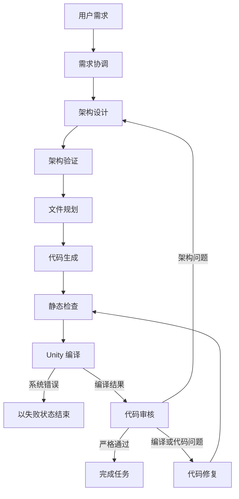
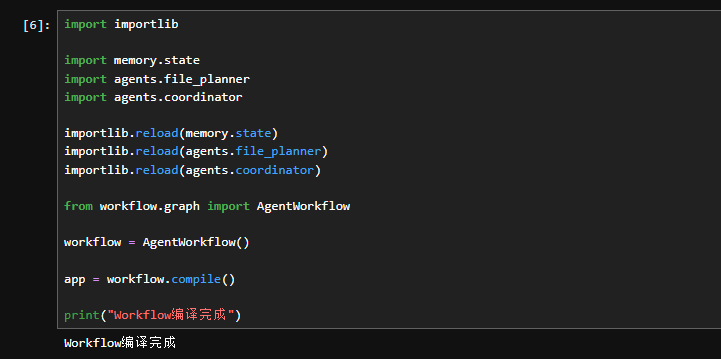
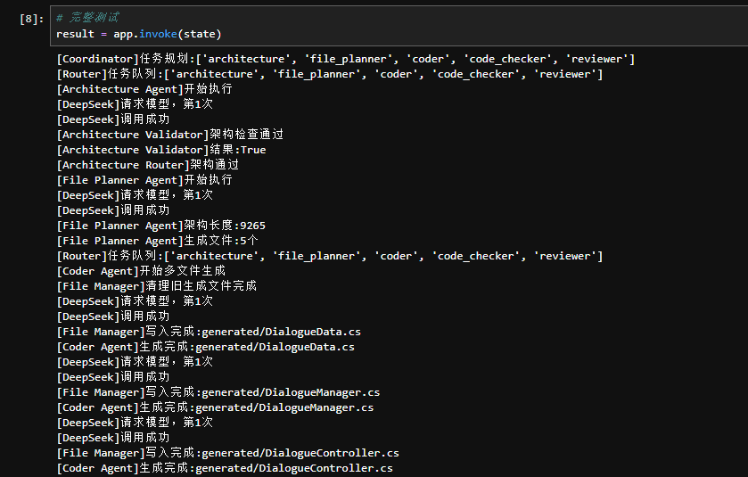
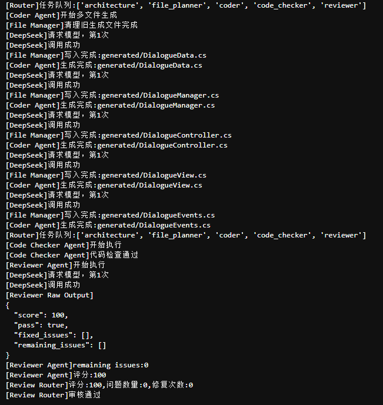

# 🚀 LangGraph Coding Agent

<p align="center">
  
</p>

<p align="center">
  <b>基于 LangGraph、LangChain、DeepSeek 与 Unity Compiler 构建的多智能体编程工作流。</b>
</p>

<p align="center">
  
  
  
  
  
</p>

## 🌟 项目简介

LangGraph Coding Agent 用于探索多个专业智能体如何协作完成软件工程任务。当前版本可以分析需求、设计架构、规划并生成多个文件、执行静态检查、编译 Unity C# 代码、结合编译器证据进行审核，并在有限次数内自动修复错误。

> 💡 **项目目标**：让 AI Agent 不只“生成代码”，还能够读取真实编译器反馈、定位问题、执行修复并验证最终结果。

```text
需求分析 → 架构设计 → 文件规划 → 代码生成
                              ↓
完成 ← 代码审核 ← Unity 编译 ← 静态检查
           ↓             ↑
         代码修复 ───────┘
```

## ✨ Day06-4 已实现能力

- 在独立测试工程中执行真实 Unity BatchMode 编译。
- 结构化解析并去重 C# 编译错误。
- 通过 `compile_history`、`review_history` 和 `repair_history` 记录每轮状态。
- 通过 `review_retry_count` 控制 Reviewer JSON 格式异常重试。
- 真实编译器结果优先于模型生成的编译结论。
- 系统或环境错误会终止修复循环，不会被误判为代码错误。
- 只有同时满足以下条件才允许完成任务：
  - Code Checker 检查成功；
  - Unity 编译成功；
  - Reviewer 评分不低于 90；
  - Reviewer 返回 `pass=true`；
  - `remaining_issues` 为空。
- 已验证以下真实修复闭环：

```text
编译失败
→ Reviewer 提取根因
→ Repair Agent 修复
→ Code Checker 复查
→ Unity Compiler 重新编译
→ Reviewer 审核通过
→ finish_task
```

## 🤖 智能体职责

| 智能体 | 职责 |
|---|---|
| Coordinator | 理解用户需求并准备工作流 |
| Architecture | 设计目标系统架构 |
| Architecture Validator | 验证架构输出 |
| File Planner | 规划需要生成的源文件 |
| Coder | 生成多文件代码 |
| Code Checker | 执行项目静态检查 |
| Unity Compiler | 同步并编译生成的 C# 文件 |
| Reviewer | 综合代码、静态检查和编译器证据进行审核 |
| Repair | 根据结构化根因修复文件 |

## 🔄 工作流

<p align="center">
  
</p>



修复循环具有明确的次数上限。达到上限时会结束执行，但不会将失败状态误报为成功。

## 📸 运行效果

### 🧭 多智能体工作流

<p align="center">
  
</p>

### 🛠️ 自动修复闭环

<p align="center">
  
</p>

### 📂 多文件生成结果

<p align="center">
  
</p>

## 🗂️ 项目结构

```text
LangGraph-Coding-Agent/
├── agents/
│   ├── architecture.py
│   ├── architecture_validator.py
│   ├── code_checker.py
│   ├── coder.py
│   ├── coordinator.py
│   ├── file_planner.py
│   ├── repair.py
│   ├── reviewer.py
│   └── unity_compiler.py
├── memory/
│   └── state.py
├── prompts/
│   ├── repair_prompt.py
│   └── reviewer_prompt.py
├── tools/
│   ├── code_check_tool.py
│   ├── file_manager.py
│   └── unity_compile_tool.py
├── workflow/
│   ├── graph.py
│   ├── review_router.py
│   ├── router.py
│   └── task.py
├── main.py
├── requirements.txt
├── CONTRIBUTING.md
└── LICENSE
```

## 📦 安装

```bash
git clone https://github.com/MaddieMo1/LangGraph-Coding-Agent.git
cd LangGraph-Coding-Agent
pip install -r requirements.txt
```

## ⚙️ 配置

复制 `.env.example` 并重命名为 `.env`，然后配置 DeepSeek 与本地 Unity 测试环境：

```env
DEEPSEEK_API_KEY=your_api_key_here
DEEPSEEK_MODEL=deepseek-chat
DEEPSEEK_BASE_URL=https://api.deepseek.com

UNITY_EDITOR_PATH=D:\Unity\Hub\Unity_Editor\2022.3.62f2c1\Editor\Unity.exe
UNITY_TEST_PROJECT_PATH=D:\Unity\Unity_Project\CodingAgentTest
```

Unity 测试工程必须包含有效的 `Assets/`、`Packages/` 和 `ProjectSettings/` 目录。生成脚本只会同步到测试工程的 `Assets/Generated`。

## ▶️ 运行

```bash
python main.py
```

## 🧪 Day06-4 验收标准

已验证的验收流程会先备份 `generated`，再注入一个临时 C# 语法错误，并执行真实修复闭环。通过结果必须同时满足：

```text
第 1 轮：Unity 编译失败，system_error=false
修复阶段：至少有一个成功的文件修改动作
第 2 轮及以后：Unity 编译成功
最终审核：score>=90、pass=true、remaining_issues=[]
最终路由：finish_task
清理阶段：恢复后的 generated 代码再次编译成功
```

> ⚠️ **重要**：不能只根据 `finish_task` 判断成功，必须同时检查编译器、静态检查器和 Reviewer 的状态字段。

## 🗺️ 开发路线

### ✅ v0.1.0 — 已完成

- 多智能体工作流；
- 架构设计与文件规划；
- 多文件代码生成；
- Reviewer 与基础修复循环。

### ✅ v0.2.0 — 已完成（Day06-4）

- 编译器级代码检查；
- 真实 Unity BatchMode 编译；
- 结构化编译错误解析；
- 编译、审核和修复历史；
- 严格通过条件与有限路由；
- 真实编译—修复—验证闭环。

### 🚧 v0.3.0 — 下一阶段（Day06-5）

- 工程化 Repair Tool；
- 使用精准补丁替代 Agent 直接写文件；
- 补丁历史与验证元数据。

### 🔭 后续计划

- Unity API 知识检索；
- 项目级代码理解；
- 长期记忆；
- 人工审批工作流；
- 隔离执行沙箱。

## 🤝 参与贡献

欢迎参与项目开发。提交代码前请阅读[贡献指南](./CONTRIBUTING.md)。

## 📄 许可证

本项目使用 [MIT 许可证](./LICENSE)。
