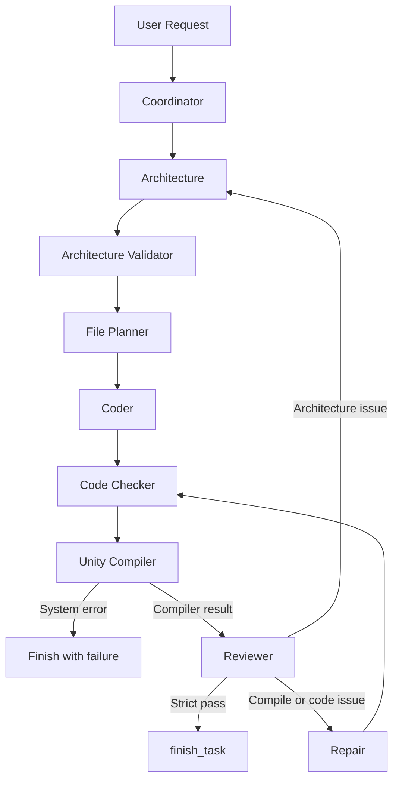

# LangGraph Coding Agent

<p align="center">
  
</p>

<p align="center">
  <b>A multi-agent coding workflow built with LangGraph, LangChain, DeepSeek, and the Unity compiler.</b>
</p>

<p align="center">
  
  
  
  
  
</p>

## Overview

LangGraph Coding Agent explores how specialized AI agents can collaborate on a software-engineering workflow. The current version can analyze a requirement, design an architecture, generate multiple files, perform static checks, compile generated Unity C# code, review compiler evidence, and repair failures in a bounded loop.

```text
Requirement → Architecture → File Plan → Code Generation
                                      ↓
Finish ← Reviewer ← Unity Compiler ← Code Checker
             ↓              ↑
           Repair ──────────┘
```

## Day06-4 capabilities

- Real Unity BatchMode compilation in an isolated test project.
- Structured parsing and deduplication of C# compiler errors.
- `compile_history`, `review_history`, and `repair_history` state tracking.
- Reviewer JSON retry control through `review_retry_count`.
- Compiler evidence takes priority over model-generated compiler claims.
- System/environment errors terminate the repair loop instead of being treated as code defects.
- Strict completion requires all of the following:
  - Code Checker succeeds.
  - Unity compilation succeeds.
  - Reviewer score is at least 90.
  - Reviewer returns `pass=true`.
  - `remaining_issues` is empty.
- Verified repair route:

```text
Compile failure
→ Reviewer root cause
→ Repair Agent
→ Code Checker
→ Unity Compiler
→ Reviewer pass
→ finish_task
```

## Agents

| Agent | Responsibility |
|---|---|
| Coordinator | Understand the request and prepare the workflow |
| Architecture | Design the target system |
| Architecture Validator | Validate architecture output |
| File Planner | Plan generated source files |
| Coder | Generate multi-file code |
| Code Checker | Perform static project checks |
| Unity Compiler | Synchronize and compile generated C# files |
| Reviewer | Combine code, checker, and compiler evidence |
| Repair | Repair files from structured root causes |

## Workflow



The repair loop is bounded. Reaching the retry limit terminates execution without falsely reporting success.

## Project structure

```text
LangGraph-Coding-Agent/
├── agents/
│   ├── architecture.py
│   ├── architecture_validator.py
│   ├── code_checker.py
│   ├── coder.py
│   ├── coordinator.py
│   ├── file_planner.py
│   ├── repair.py
│   ├── reviewer.py
│   └── unity_compiler.py
├── memory/
│   └── state.py
├── prompts/
│   ├── repair_prompt.py
│   └── reviewer_prompt.py
├── tools/
│   ├── code_check_tool.py
│   ├── file_manager.py
│   └── unity_compile_tool.py
├── workflow/
│   ├── graph.py
│   ├── review_router.py
│   ├── router.py
│   └── task.py
├── main.py
├── requirements.txt
├── CONTRIBUTING.md
└── LICENSE
```

## Installation

```bash
git clone https://github.com/MaddieMo1/LangGraph-Coding-Agent.git
cd LangGraph-Coding-Agent
pip install -r requirements.txt
```

## Configuration

Copy `.env.example` to `.env`, then configure DeepSeek and the local Unity test environment:

```env
DEEPSEEK_API_KEY=your_api_key_here
DEEPSEEK_MODEL=deepseek-chat
DEEPSEEK_BASE_URL=https://api.deepseek.com

UNITY_EDITOR_PATH=D:\Unity\Hub\Unity_Editor\2022.3.62f2c1\Editor\Unity.exe
UNITY_TEST_PROJECT_PATH=D:\Unity\Unity_Project\CodingAgentTest
```

The Unity project must contain valid `Assets/`, `Packages/`, and `ProjectSettings/` directories. Generated scripts are synchronized only into `Assets/Generated`.

## Run

```bash
python main.py
```

## Day06-4 acceptance test

The verified acceptance scenario injects a temporary C# syntax error into a backed-up `generated` directory, then runs the real closed loop. A passing result must contain:

```text
Round 1: Unity compile failed, system_error=false
Repair: at least one successful file action
Round 2+: Unity compile succeeded
Reviewer: score>=90, pass=true, remaining_issues=[]
Route: finish_task
Cleanup: restored generated code compiles successfully
```

Do not treat `finish_task` alone as success. Always inspect the compiler, checker, and reviewer fields together.

## Roadmap

### v0.1.0 — Completed

- Multi-agent workflow
- Architecture and file planning
- Multi-file generation
- Reviewer and basic repair loop

### v0.2.0 — Completed (Day06-4)

- Compiler-level code checking
- Real Unity BatchMode compilation
- Structured compiler error parsing
- Compile, review, and repair histories
- Strict completion rules and bounded routing
- Verified compile–repair–verify loop

### v0.3.0 — Next (Day06-5)

- Engineering-grade Repair Tool
- Precise patch application instead of direct Agent file writes
- Patch history and verification metadata

### Later

- Unity API knowledge retrieval
- Project-level code understanding
- Long-term memory
- Human approval workflow
- Isolated execution sandbox

## Contributing

Contributions are welcome. Read [CONTRIBUTING.md](./CONTRIBUTING.md) before opening a pull request.

## License

This project is licensed under the [MIT License](./LICENSE).
